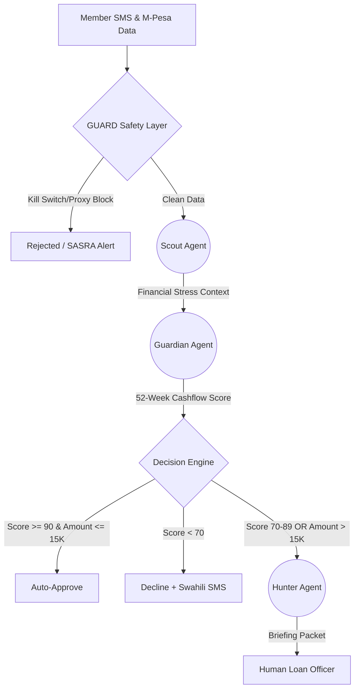

# 🦁 Fair Lending Guardian

[](https://fair-lending-guardian.streamlit.app)

> **AI Safari Capstone · Module 4: Agent Savannah · June 2026**
>
> A three-agent AI pride built with [CrewAI](https://www.crewai.com/) that screens loan
> applications for Ujima SACCO members using harvest-cycle cashflow analysis — not
> occupation labels, gender, or sub-county proxies.

---

## Table of Contents

- [Overview](#overview)
- [How It Works](#how-it-works)
- [Architecture](#architecture)
  - [Agent Pride](#agent-pride)
  - [GUARD Safety Layer](#guard-safety-layer)
  - [Task Pipeline](#task-pipeline)
- [Project Structure](#project-structure)
- [Prerequisites](#prerequisites)
- [Setup](#setup)
- [Running the App](#running-the-app)
  - [Streamlit UI (recommended)](#streamlit-ui-recommended)
  - [CLI (terminal run)](#cli-terminal-run)
- [Configuration](#configuration)
  - [LLM Providers](#llm-providers)
- [GUARD Safety Mechanisms](#guard-safety-mechanisms)
- [Design Principles](#design-principles)
- [Known Limitations & Roadmap](#known-limitations--roadmap)

---

## Overview

Ujima SACCO serves smallholder farmers and market vendors in Western Kenya — a population
that traditional credit scoring systematically undervalues because their income is
seasonal (harvest-cycle driven) rather than salaried.

**Fair Lending Guardian** replaces proxy-based underwriting (occupation, sub-county,
gender) with 52-week M-Pesa transaction pattern analysis. It does not approve or deny
loans on its own for amounts above KES 15,000; it prepares structured briefing packets
for human loan officers while enforcing strict dignity and anti-discrimination guardrails.

**Headline targets:**

| Metric | Target |
|---|---|
| Female vendor approval uplift | +37 percentage points vs baseline |
| Portfolio default rate ceiling | < 3% |
| Member data sovereignty | 100% (no third-party data sharing) |
| Human-in-the-loop threshold | All loans > KES 15,000 |

---

## Module Progression

This capstone is built on the AI Safari curriculum progression:

| Module | Focus | Frameworks |
|---|---|---|
| 1. The Savannah Adventure | Core AI concepts and maps | AIM, MAP |
| 2. The Tsavo Adventure | Prompt engineering and 4D | 4D Framework |
| 3. The Ethical Savannah | AI safety and data rights | ETHOS, TRACK, OASIS, PRIDE, HORIZON |
| 4. The Agent Savannah | Autonomous agents | RANK, TRAIL, HUNT, GUARD, CYCLE |

---

## How It Works

## Prototype Honesty (What is Real vs Simulated)
For full transparency in the AI Safari Capstone evaluation:
- **[REAL] The AI Automation**: The CrewAI orchestration, LiteLLM fallback chains, system prompts, and the PRIDE/GUARD frameworks are fully implemented and execute dynamically.
- **[SIMULATED] The Data Pipeline**: The 52-week M-Pesa transaction histories are static mock data (`mock_data.py`). The system is not connected to a live Safaricom/M-Pesa API.
- **[SIMULATED] External Alerts**: SASRA regulatory alerts and loan officer notifications are simulated by logging to local SQLite databases.

---

### The Problem It Solves

Traditional credit scoring fails smallholder farmers and informal traders in Kenya.
A market vendor or maize farmer has **seasonal, irregular income** — but that is
completely normal for their context, not a sign of risk. Conventional bank algorithms
see irregular cashflow and reject the application. Fair Lending Guardian understands
that context and screens loans fairly.

### The Solution
Instead of static algorithms, we use **Agent Savannah**—a CrewAI orchestration of three distinct AI personas protected by the **GUARD** safety layer:



These agents understand that an income dip in January isn't "risk"—it's school fees.

### System Layers (from bottom to top)

#### Layer 1 — GUARD (`guard.py`) — runs before any AI

Four pure-Python safety rules that fire **before** the agents start. No LLM is involved:

| Function | What it does |
|---|---|
| `proxy_block()` | Rejects inputs containing `gender`, `tribe`, `ethnicity`, `religion`, `sub_county_risk` — illegal discrimination proxies |
| `kill_switch_check()` | If the member's SMS mentions `"loan shark"`, `"debt collector"`, `"lawyer"`, `"court"` — the whole system pauses and escalates to a human supervisor immediately |
| `dignity_filter()` | Scans AI outputs for words like `"unreliable"`, `"risky"`, `"informal"`, `"irregular"` — banned because they dehumanise the applicant |
| `unusual_pattern_check()` | If the system's approval rate drops >30 percentage points vs the 30-day baseline, it triggers a SASRA regulatory notification |

This is the safety harness — the agents literally cannot run if GUARD fires.

#### Layer 2 — The Three Agents (`agents.py`, `tasks.py`)

All three share the same LLM (configurable — see [LLM Providers](#llm-providers)),
run sequentially, and cannot delegate to each other (`allow_delegation=False`) — that
prevents an agent from silently spawning extra LLM calls.

**🔭 Scout Agent**
- Reads the member's SMS message and profile (name, age, occupation, dependants, harvest months)
- Detects whether the SMS is a financial stress signal
- If yes, packages a structured handoff — child ages, next harvest date, estimated savings — and passes it to the Guardian
- Hard constraint: max 3 SMS per day per member, never recommends specific loan products

**🛡️ Guardian Agent**
- Receives the Scout's handoff plus 52 weeks of M-Pesa weekly inflows
- Runs a full cashflow analysis (average inflow, income stability, repayment capacity ratio)
- Applies routing rules in strict order:

```
Loan > KES 15,000 (any score)     → MANDATORY escalation to Hunter
Score ≥ 90 and loan ≤ KES 15,000  → APPROVE directly
Score 70–89                        → ESCALATE to Hunter Agent
Score < 70 with 3+ risk flags      → DECLINE with empathetic SMS
```

- Critical design decision: seasonal income spikes (harvest months) are classified as
  **neutral**, not risk flags. A high-to-low ratio above 3.0 = expected for farmers.

**🎯 Hunter Agent**
- Receives the Guardian's enriched assessment
- Writes a structured briefing packet for a named human loan officer
- Matches the officer to the applicant by speciality (e.g., maize farming expertise for Kakamega)
- **Cannot approve or deny anything** — its only job is to prepare the packet and alert
  the officer within 15 minutes

#### Layer 3 — The PRIDE Loop (`app.py`)

A mandatory human gate enforced in the UI. If the loan exceeds **KES 15,000**, the app
shows a hard warning block:

> "A named human loan officer must make the final decision.
> Officer SLA: 15 minutes. Member appeal right: dial \*#123#."

The AI is **advisory only** — the human officer owns the final call.

#### Layer 4 — The UI (`app.py` with Streamlit)

A web form where you enter the applicant's details, hit **"Run Agent Pride"**, and
watch the three agents work sequentially. The final Hunter briefing packet renders
on the page. There is also a CLI entry point (`main.py`) for debugging without the UI.

### The Reference Test Case (`mock_data.py`)

The default applicant is **Grace Achieng**, age 42, maize farmer in Kakamega North,
asking for **KES 28,000** for school fees. Her 52-week M-Pesa history shows:

- Steady ~KES 3,000–3,400/week most weeks
- Spikes to ~KES 6,500–6,800 in harvest months (March/April, September/October)
- Dips to ~KES 1,800–2,100 in January (school fee month, cash depleted)

A traditional algorithm penalises the dips and flags the spikes. This system
recognises both as **culturally expected patterns** and scores her fairly.

### Tech Stack Summary

```
Streamlit          → Web UI layer
CrewAI             → Multi-agent orchestration framework
LiteLLM            → Universal LLM adapter (routes to all supported providers)
Mistral / Gemini / Groq / Cohere / Cerebras  → Configurable LLM backends
guard.py           → Pure Python safety rules (no AI involved)
```

---

## Architecture

### Agent Pride

The system runs three specialised agents in a **sequential pipeline** (CrewAI
`Process.sequential`). Each agent receives the previous agent's output as context before
acting.

```
Member SMS / Loan Application
         │
         ▼
┌─────────────────────────┐
│  🔭  Scout Agent         │  Financial Literacy Coach
│  Detects stress signals  │  Warm, Swahili-influenced English
│  Max 3 SMS/day/member    │  Kill switch: dial 700
└────────────┬────────────┘
             │ Structured stress context
             ▼
┌─────────────────────────┐
│  🛡️  Guardian Agent      │  Loan Triage Officer (TRACK-audited)
│  52-week cashflow score  │  Approves ≤ KES 15,000 at score ≥ 90
│  Score 70–89 → escalate  │  Kill switch: dial 733
│  < 70 w/ 3+ flags → deny │
└────────────┬────────────┘
             │ Enriched briefing context
             ▼
┌─────────────────────────┐
│  🎯  Hunter Agent        │  Human-in-Loop Coordinator
│  Builds officer packet   │  Never approves/denies independently
│  15-min officer SLA      │  Full kill switch: dial 799
│  Surfaces cross-sells    │  Convenes Elders Council within 2 days
└─────────────────────────┘
             │
             ▼
   Human Loan Officer
   (final decision owner)
```

#### Agent Autonomy Boundaries

| Agent | Can approve? | Can deny? | Can escalate? |
|---|---|---|---|
| Scout | ✗ | ✗ | ✓ (to Guardian) |
| Guardian | ✓ (≤ KES 15,000, score ≥ 90) | ✓ (score < 70 with 3+ risk flags) | ✓ (score 70–89 → Hunter) |
| Hunter | ✗ | ✗ | ✗ — briefing packet only |

### GUARD Safety Layer

Runs **before** the agent pride kicks off, and is available as utility functions for
post-processing agent output. See [`guard.py`](guard.py).

```
Loan Input ──► proxy_block()     ─► Blocks banned scoring features
Member SMS ──► kill_switch_check() ─► Escalates on crisis phrases
Agent Output ► dignity_filter()  ─► Blocks dehumanising language
Approval Rate ► unusual_pattern_check() ─► SASRA alert if rate drops > 30pp
```

### Task Pipeline

Each task receives the previous task's output via CrewAI's `context=` parameter:

```
scout_task  (no upstream context)
    │
    └──context──► guardian_task
                      │
                      └──context──► hunter_task
```

---

## Project Structure

```
fair-lending-guardian/
├── agents.py          # Three CrewAI Agent definitions (Scout, Guardian, Hunter)
├── tasks.py           # Task factory — build_tasks(application) → [scout, guardian, hunter]
├── guard.py           # GUARD safety layer: dignity filter, proxy block, kill switch
├── crewai_env.py      # CrewAI environment bootstrap (writable paths, telemetry off)
├── mock_data.py       # Grace Achieng — reference test applicant with 52-week M-Pesa data
├── main.py            # CLI entry point — runs the crew and prints the final briefing packet
├── app.py             # Streamlit web UI — full form input + live agent status indicators
├── requirements.txt   # Python dependencies
├── runtime.txt        # Python runtime pin (for Streamlit Cloud)
├── .env.example       # Environment variable template
└── .env               # Local secrets — NOT committed to Git
```

---

## Prerequisites

- **Python 3.11+** (see `runtime.txt` for exact pin)
- A virtual environment manager (`venv`, `uv`, etc.)
- **One** of the following LLM backends:
  - **Ollama** installed locally + `ollama pull mistral` (zero rate limits, no API key)
  - **Google AI Studio API key** — [aistudio.google.com](https://aistudio.google.com/app/apikey) (Gemini 2.5 Flash)
  - **Groq API key** — [console.groq.com](https://console.groq.com) (Llama 3.1 8B Instant)
  - **Cohere API key** — [dashboard.cohere.com](https://dashboard.cohere.com/api-keys) (Command R, 1 000 req/month free)
  - **Cerebras API key** — [cloud.cerebras.ai](https://cloud.cerebras.ai) (Llama 3.1 8B, very fast)

---

## Setup

```bash
# 1. Clone and enter the repo
git clone <repo-url>
cd fair-lending-guardian

# 2. Create and activate a virtual environment
python3 -m venv .venv
source .venv/bin/activate

# 3. Install dependencies
pip install -r requirements.txt

# 4. Configure secrets
cp .env.example .env
# Edit .env and fill in your API key(s)
```

---

## Running the App

### Streamlit UI (recommended)

```bash
streamlit run app.py
```

Opens at `http://localhost:8501`. Fill in the loan application form, hit
**"Run Agent Pride — Process Application"**, and watch the three agents work
sequentially. The final briefing packet renders in the page.

### CLI (terminal run)

Runs the Grace Achieng reference case defined in `mock_data.py`:

```bash
python main.py
```

Output includes GUARD pre-flight results, agent verbose reasoning, and the final
Hunter Agent briefing packet.

---

## Configuration

### LLM Providers

Set `LLM_PROVIDER` in your `.env` file. Only the key for your chosen provider is needed:

| `LLM_PROVIDER` value | Model | Required env var | Notes |
|---|---|---|---|
| `gemini` *(default)* | `gemini/gemini-2.5-flash` | `GOOGLE_API_KEY` | 60 req/min free tier |
| `groq` | `groq/llama-3.1-8b-instant` | `GROQ_API_KEY` | 60 req/min free tier, very fast |
| `ollama` | `ollama/mistral` | none | Local only — run `ollama pull mistral` first |
| `cohere` | `cohere/command-a-03-2025` | `COHERE_API_KEY` | 1 000 req/month free trial |
| `cerebras` | `cerebras/llama3.1-8b` | `CEREBRAS_API_KEY` | OpenAI-compatible, very fast |

**Rate limiting:** the Streamlit app automatically retries up to 3 times with
exponential back-off (5 → 15 → 45 seconds) on rate limit or transient 503 errors
from any provider.

**`cache_breakpoint` compatibility patch:** CrewAI injects `cache_breakpoint` markers
into messages that some APIs (Groq, Ollama, Cohere, Cerebras) reject. `agents.py`
handles this via a `SafeLLM` subclass and a `litellm.completion` wrapper that strips
the unsupported field before every call, for all providers.

---

## GUARD Safety Mechanisms

All functions live in [`guard.py`](guard.py).

### `dignity_filter(text)`

Scans any agent output string for dehumanising language. Raises `ValueError` if a
banned term is found.

**Banned terms:** `unreliable`, `risky`, `informal`, `unverifiable`, `unstable`,
`suspicious`, `irregular`

```python
dignity_filter(agent_output)  # raises ValueError on violation
```

### `proxy_block(features: dict)`

Hard-blocks features that are illegal proxies for credit discrimination under Kenyan
financial inclusion standards.

**Blocked features:** `gender`, `ethnicity`, `tribe`, `religion`, `sub_county_risk`

```python
proxy_block({"income": 1, "mpesa_history": 1})  # PASSES
proxy_block({"gender": "F", "income": 1})         # RAISES ValueError
```

### `kill_switch_check(message: str)`

Detects crisis signals in member SMS messages and triggers immediate human escalation.

**Trigger phrases:** `loan shark`, `debt collector`, `lawyer`, `court`

```python
kill_switch_check("debt collector came to my house")  # RAISES ValueError → human escalation
```

### `unusual_pattern_check(approval_rate, baseline)`

Statistical guardrail. If the system's approval rate drops more than 30 percentage
points vs the 30-day baseline, it raises a `ValueError` requiring a SASRA notification
within 4 hours.

```python
unusual_pattern_check(approval_rate=40.0, baseline=75.0)  # raises — 35pp drop
```

### Kill Switch Phone Numbers

| Switch | Dial | Scope |
|---|---|---|
| Scout kill switch | 700 | Pauses Scout outbound SMS |
| Guardian kill switch | 733 | Pauses Guardian scoring |
| Full system kill switch | 799 | Pauses all three agents, convenes Elders Council |
| Member appeal | `*#123#` | Free, zero credit score impact |

---

## Design Principles

### 1. Harvest-cycle creditworthiness, not occupation labels

Guardian Agent scores solely on cashflow metrics:
- Average weekly inflow from 52 weeks of M-Pesa data
- High-to-low income ratio (seasonal flag at > 3.0×)
- Alignment of income dips with school fee months and harvest gaps
- Repayment capacity ratio

Sub-county address, gender, and occupation category are **explicitly excluded** from
scoring inputs.

### 2. Human remains the final decision owner

No agent can approve a loan above KES 15,000 independently. The Hunter Agent's output
is a **briefing packet only** — it routes to a named human officer with a 15-minute SLA.

### 3. Empathetic denials

Every denial must include an SMS in the member's declared language with a specific,
actionable next step. The words *unreliable*, *risky*, *informal*, and *unverifiable*
are hard-blocked system-wide.

### 4. Data sovereignty

`crewai_env.py` redirects CrewAI's home and data directories to project-local paths
and disables all CrewAI telemetry and tracking. No member data leaves the local
environment.

```python
os.environ["CREWAI_DISABLE_TELEMETRY"] = "true"
os.environ["CREWAI_DISABLE_TRACKING"] = "true"
```

### 5. Dignity at the centre

The Hunter Agent's briefing packet is explicitly instructed to frame every case around
the member's dignity — not the risk metrics. Cross-sell opportunities (e.g., drought
insurance) are surfaced as additions, not conditions.

---

## Sample Run — First Live Deployment (June 2026)

**Applicant:** Grace Achieng · Maize farmer · Kakamega North · KES 28,000 · School fees Term 1

**LLM:** Gemini 2.5 Flash (Streamlit Cloud)

### What each agent produced

| Agent | Output | Notes |
|---|---|---|
| 🔭 Scout | Stress signal confirmed. Child ages 6/9/14. Next harvest March/April. No GUARD kill switch flags. | Correct. |
| 🛡️ Guardian | Avg weekly inflow KES 3,231. High-to-low ratio 3.78 → seasonal. Score: 20/100. Decision: **Decline**. | ⚠️ See Bug #1 and Bug #2 below. |
| 🎯 Hunter | Briefing packet generated. "Age: Not specified." "Dependant ages: Not specified." | ⚠️ See Bug #3 below. |

One transient **Gemini 503** error occurred during the Hunter Agent turn. CrewAI's
built-in retry recovered automatically on the second attempt.

### Bugs discovered and fixed

#### Bug #1 — Guardian routing gap (KES > 15,000 loans were not always escalated)

**Root cause:** The Guardian task description's routing rules only covered three cases:
score 70–89 → Hunter, score ≥ 90 AND amount ≤ KES 15,000 → approve, score < 70 with
3+ flags → decline. No rule covered "score < 70 AND amount > KES 15,000", so the LLM
declined a KES 28,000 loan independently — which it has no authority to do.

**Fix:** Added an explicit **RULE A** at the top of the routing section:
> *If loan amount exceeds KES 15,000, you MUST escalate to the Hunter Agent regardless
> of creditworthiness score.*

#### Bug #2 — Guardian over-penalised seasonal income

**Root cause:** The task said "if high-to-low ratio > 3.0, classify as seasonal" but
gave no framing. The LLM treated seasonal income as a negative credit signal and scored
Grace at 20/100, directly contradicting the system's stated purpose.

**Fix:** Added explicit framing before the scoring steps:
> *Seasonal income is EXPECTED and NORMAL for smallholder farmers. A high-to-low ratio
> above 3.0 is NOT a negative credit signal on its own.*

The scoring instructions now also explicitly state: *Do NOT penalise seasonal income
patterns — they are expected.*

#### Bug #3 — Hunter Agent lost applicant age and dependant ages

**Root cause:** The Hunter task only received the Guardian's output via
`context=[guardian_task]`. The Guardian's output summarised cashflow metrics but did
not repeat the applicant's age (42) or dependant ages (6, 9, 14) — so the Hunter
printed "Not specified in current data."

**Fix:** The Hunter task description now directly embeds the known applicant facts
(name, age, occupation, sub-county, dependants, loan amount, purpose) as hard-coded
context alongside the Guardian's analysis. These fields are drawn from the application
dict at task-build time, not inferred from agent outputs.

---

## Known Limitations & Roadmap

| Limitation | Planned fix |
|---|---|
| M-Pesa inflow data is hardcoded (Grace mock) | Connect to real M-Pesa statement parser |
| 52-week inflows are not fetched live | Integrate Safaricom Open API or statement upload |
| ~~`LLM_PROVIDER` switching requires restart~~ | ✅ Done — 5 providers supported via `.env`: `gemini`, `groq`, `ollama`, `cohere`, `cerebras` |
| No persistent audit log of decisions | Add SQLite/PostgreSQL decision log |
| No multilingual SMS output | Add Swahili and Dholuo output modes |
| SASRA notification is a stub (`raise ValueError`) | Wire to real alerting channel (email/SMS gateway) |
| LLM temperature fixed at 0.2 | Expose temperature as env var |
| Gemini 503 transient errors on Hunter turn | Add explicit retry loop (currently relies on CrewAI internal retry) |

---

## Migration: Streamlit to Vite plus React plus TypeScript

The system architecture has been split into a decoupled frontend and backend to support complex UI requirements and mobile rendering.

- **Development:** Two servers run simultaneously. The React frontend runs on port `5173` (Vite dev server) and proxies API calls to the FastAPI backend running on port `8000`.
- **Production:** A single-server setup. The FastAPI backend serves the compiled React build (`frontend/dist`) as static files on the root `/` route.

**How to run locally:**
1. In the root directory, install Python dependencies: `pip install -r requirements.txt`
2. In the `frontend/` directory, install Node dependencies: `npm install`
3. Open two terminals:
   - Terminal 1 (Backend): `uvicorn server:app --reload`
   - Terminal 2 (Frontend): `cd frontend && npm run dev`

---

*Fair Lending Guardian is a prototype built for the AI Safari capstone (Module 4:
Agent Savannah). All AI output is advisory only. A named human loan officer owns every
final lending decision.*
